=====================================================================
마커-경로설정 / 항목탭 활용
=====================================================================

| 인천시 버스 노선 데이터를 활용하여 지도에서 **항목** 탭의 항목 변수를 사용하는 방법과 마커의 **경로 설정** 을 사용하여 지도에 경유하는 정류장을 화살표 라인으로 표현하는 예제입니다.
| 지도의 기본 레이어인 "layer map(지도)" 에서 **변수값 설정** 을 통해 이벤트 변수로 받은 좌표로 자동으로 지도를 이동하는 방법을 설명합니다.

.. contents::
    :backlinks: top

**예제 보고서**

`EDU_지도_경로설정_항목_사용예제 <http://b-iris.mobigen.com:80/studio/exported/8c69efb6c5e74ee7a4a32413ec908c827fe6153bc7ad43488275facd21847d5a>`__ 

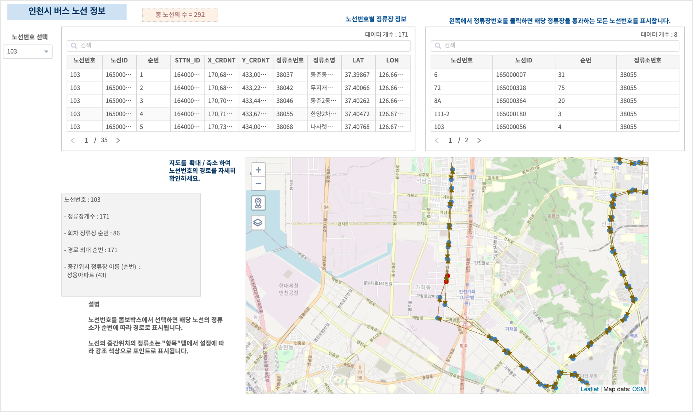

---------------------------------------------------------
데이터
---------------------------------------------------------

| 공공데이터  `인천광역시 버스노선별 정류장 현황 <https://www.data.go.kr/data/15048265/fileData.do>`__  에서 csv 파일을 다운로드합니다. 

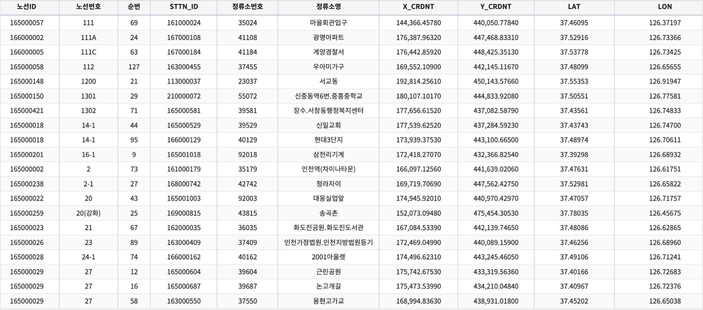

**다운로드**

| 원본 데이터에는 위, 경도 좌표가 X_CRDNT, Y_CRDNT 로 epsg:5174 좌표계로 표시되어 있습니다.
| IRIS 에서는 epsg:4326 좌표계를 사용하므로 좌표계를 변환하여 LAT, LON 필드를 추가한 데이터로 만든 파일을 생성합니다.
| Analyzer 에서 데이터 모델 **EDU_INCHEON_BUS_COOR**  을 검색한 후 "내보내기" 로 다운로드 합니다.

---------------------------------------------------------
콤보박스 : 노선번호 선택하기
---------------------------------------------------------

| 인천시 버스 노선 번호를 콤보박스에서 선택할 수 있게 합니다.
| 데이터 모델 EDU_INCHEON_BUS_COOR 에서 `disctinct <http://docs.iris.tools/manual/IRIS-Manual/IRIS-Discovery-Middleware/command/commands/distinct.html#distinct>`__  를 사용하여 중복을 제외한 노선번호를 가져옵니다.
| 콤보박스와 연결되는 데이터객체는 오브젝트ID( 자동으로 설정되면 변경안됩니다 )는 data-8이고, 변수 명( 사용자가 변경가능합니다 )은 data_combobox1 입니다.
| 데이터객체의 검색어에서 노선번호 필드만을 가져오므로, 콤보박스의 "속성" 탭 설정에서 "화면에 보여질 필드", "값으로 사용돨 필드" 를 노선번호로 동일하게 자동 설정됩니다.
| 만약 데이터객체를 통해 여러 개의 필드를 가져오는 경우에는 상황에 맞게 필드를 선택하여 설정합니다.
| "값으로 사용될 필드" 는 콤보박스 변수(여기서는 combo_1) 에 저장되어 다른 오브젝트에 이벤트 값으로 전달됩니다.
| 콤보박스의 "항목" 탭에서 "디폴트 값 선택" 에서 디폴트로 미리 노선번호를 설정하여 디폴트 노선번호의 데이터가 테이블에 출력되도록 합니다.
| 이렇게 디폴트 값을 정해두면 사용자가 콤보박스에서 노선번호를 선택하기 전이라도 콤보박스 변수 combo_1 에는 값이 들어 있어서 combo_1 을 이벤트로 받아서 처리하는 챠트,테이블에 데이터를 보여줄 수 있습니다.

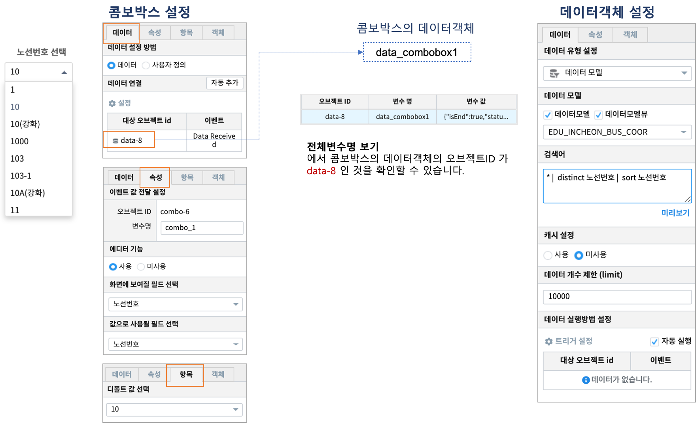

---------------------------------------------------------
테이블 1 : 노선번호 정보
---------------------------------------------------------

**데이터객체**

| 테이블에 연결된 데이터객체 이름은 **data_path_num_coor** ( 오브젝트ID = data-38 ) 입니다.

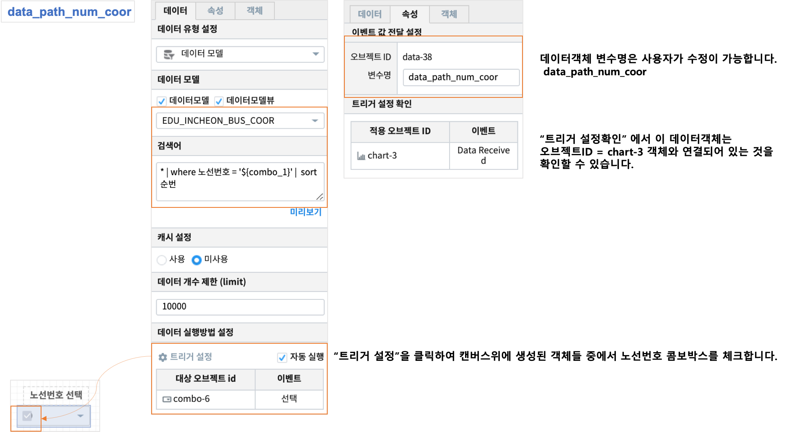

| 검색어 

.. code::

    * | where 노선번호 = '${combo_1}' |  sort 순번

| 검색어 의미 : 데이터모델 EDU_INCHEON_BUS_COOR 로부터 콤보박스의 변수 combo_1 에 저장된 노선번호 필드로 필터링한 후 순번 필드로 sorting 하여 가져옵니다. 

**테이블객체**

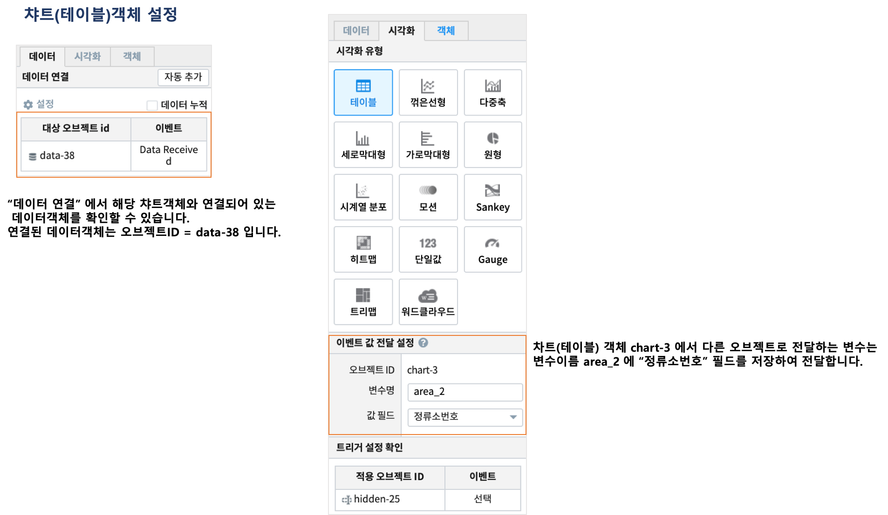

| 챠트(테이블) 객체는 연결된 데이터객체를 통해 결과 데이터를 테이블로 출력합니다.
| 그리고 "이벤트 값 전달 설정" 으로 area_2 변수에 정류소번호 필드를 전달하도록 설정합니다.
| 테이블의 특정 라인을 클릭(이벤트)하면, 해당 라인의 정류소번호 필드의 값이 변수명 area_2 에 저장되어 트리거설정이 적용된 다른 오브젝트에 전달됩니다.
| 이 테이블을 트리거로 설정한 오브젝트ID = hidden-25 는 테이블에서 선택하는 라인에 따라 달라지는 정류소번호를 검색어에서 ${area_2} 로 명기하여 활용할 수 있습니다. 

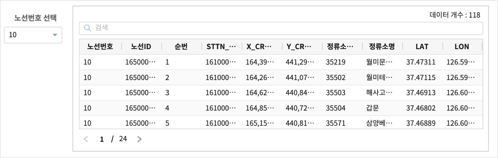

---------------------------------------------------------
테이블 2 : 정류소 정보
---------------------------------------------------------

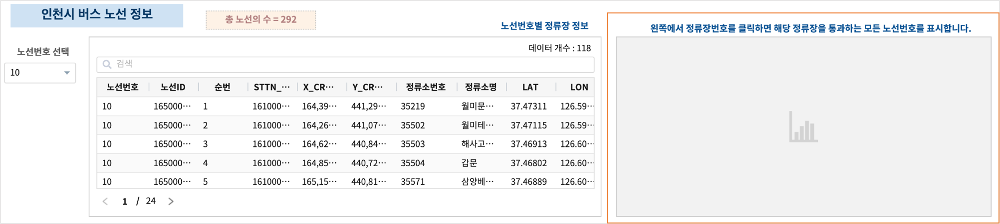

| 두번째 테이블은 처음에는 출력되는 것이 없고, 이벤트 조건에 따라 2종류의 데이터가 표시됩니다.
|
| 하나는 **첫번째 테이블** 에서 클릭한 정류소번호를 이벤트 변수로 전달받아서 해당 정류소번호와 그 정류소를 통과하는 버스 노선번호들에 대한 정보가 표시됩니다.
| 다른 하나는 **노선번호 콤보박스** 를 선택하면 이전 정류소번호 데이터는 사라지고, 선택한 노선번호에 대한 정보가 표시됩니다.
|
| 첫번째 테이블에서 정류소번호 35199 를 클릭했을 때

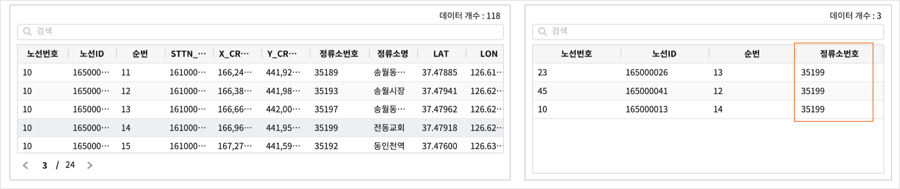

| 콤보박스에서 노선번호 103-1 를 선택하면 이전 정류소번호 35199 에 대한 내용 대신 103-1 노선번호 정보가 표시됩니다.

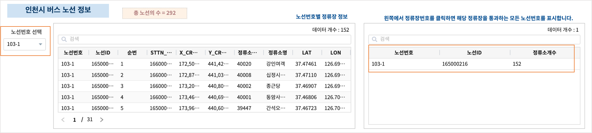

| 방법은 텍스트변환(hidden 객체) 객체를 활용하여 발생하는 이벤트에 따라 다른 검색어 구문이 실행되게 합니다.
| 다음 텍스트변환 부분에서 설명합니다.

''''''''''''''''''''''''''''''''''''''''''
텍스트변환 : hidden
''''''''''''''''''''''''''''''''''''''''''

| 택스트변환 객체의 트리거 설정을 이용하여 콤보박스에서 트리거이벤트 발생과 챠트(테이블)에서 트리거이벤트 발생할 때의 검색어 텍스트 구문을 구분하여 설정합니다.
|
| 텍스트변환 객체 hidden_1 의 트리거 설정 

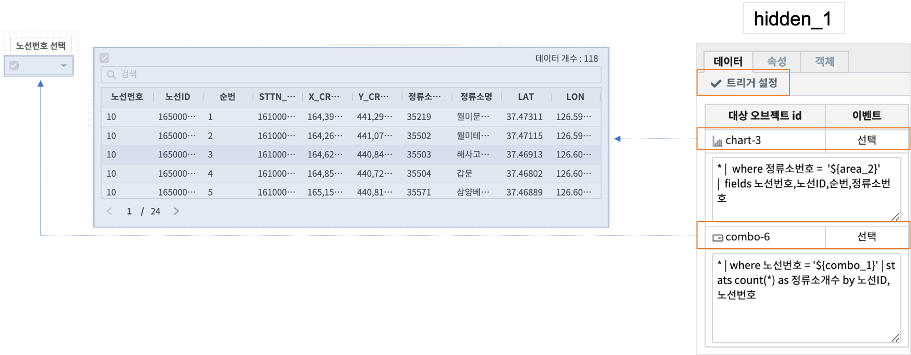

| 오브젝트ID chart-3 은 보고서의 첫번째 테이블입니다. 결과에서 특정 정류소번호를 클릭하면, "정류소번호" 필드를 area_2 변수에 저장하여 이벤트 설정값으로 전달합니다.
| 텍스트변환 객체 변수인 hidden_1 은 테이블의 정류소번호 클릭 이벤트를 트리거로 설정하고, 이 이벤트가 발생하면 
| hidden_1 변수에 

.. code::

    * |  where 정류소번호 =  '${area_2}'  
      |  fields 노선번호,노선ID,순번,정류소번호

| 를 저장합니다.
| 또 콤보박스에서 노선번호를 선택하는 이벤트를 트리거로 설정하고, 이 이벤트가 발생하면
| hidden_1 변수이

.. code::

    * | where 노선번호 = '${combo_1}' | stats count(*) as 정류소개수 by 노선ID,노선번호

| 를 저장합니다.

''''''''''''''''''''''''''''''''''''''''''
테이블 2의 데이터 객체
''''''''''''''''''''''''''''''''''''''''''

| 챠트(테이블) 의 데이터 객체의 설정

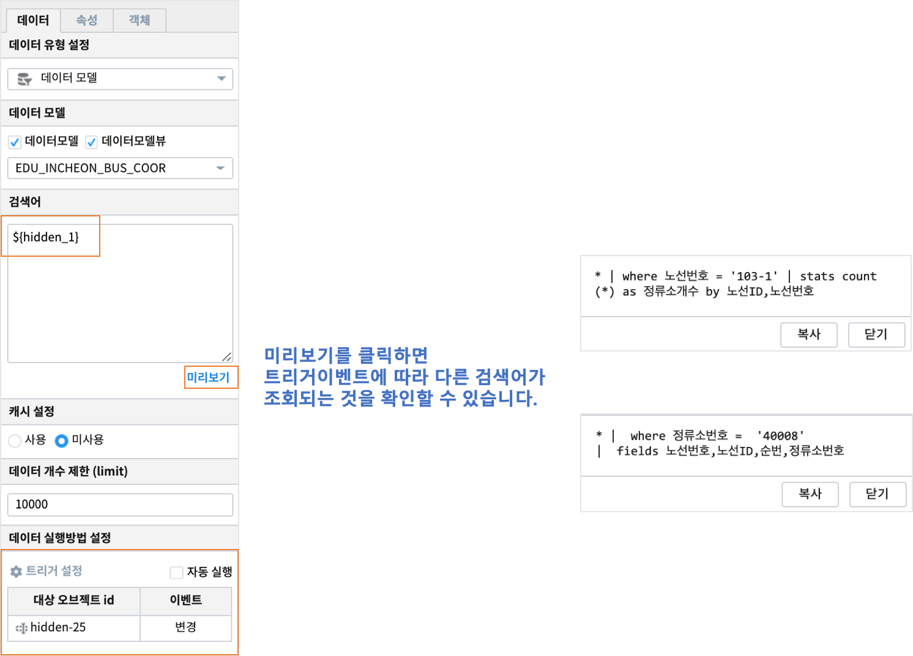

| 텍스트 변환 객체를 잘 활용하면 SQL 의 CASE WHEN 이나 IF 절처럼 트리거 오브젝트 별로 다른 검색어 구문이 실행되도록 설정할 수 있습니다.

---------------------------------------------------------
지도 : layer map(지도) 
---------------------------------------------------------

| “layer map (지도)” 레이어는 기본 지도 레이어로 Naver Web Map 과 Open Street Map 을 지도 API로 제공합니다.
| 여기서는 Naver Web Map 을 적용하였습니다.
|
| 지도에 대한 설명은 `Docs <http://docs.iris.tools/manual/index.html>`__  의  `Manual » IRIS Studio » 데이터 시각화 (Data Visualize) 객체 <http://docs.iris.tools/manual/IRIS-Manual/IRIS-Studio/data_visualize.html#map>`__ 를 참고하시기 바랍니다.
|
| “layer map (지도)” 레이어의 위치 좌표는 트리거 설정한 common_data_3 데이터객체의 변수값으로 위, 경도 좌표를 결정합니다.
| 데이터객체 변수 common_data_3 는 콤보박스에서 선택한 노선번호,기점 ~ 회차 정류소의 중간 정류소의 이름(정류소명), 순번, 위도, 경도 값을 가지고 있습니다.
| 따라서 사용자가 콤보박스에서 선택하는 노선번호에 따라 레이어에 표시되는 위치가 달라집니다. 

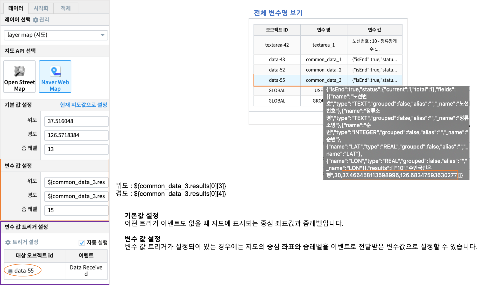

| 캔버스에서 데이터객체 “common_data_3” 을 선택한 후  실행한 후에
| “전체 변수명 보기” 에서  common_data_3 의 변수값을 확인할 수 있습니다.
| 
| results 가 실제로 이벤트 발생후에 저장된 값입니다.
| ${common_data_3.results[0][3]}  은 위도인 37.466458...   
| ${common_data_3.results[0][4]}  은 경도인 126.68347... 

 

---------------------------------------------------------
지도 : 버스노선
---------------------------------------------------------

| "버스노선" 레이어는 콤보박스에서 선택한 노선번호의 정류소를 시각화유형 마커의 포인트로 표시합니다.
| 경로설정을 사용하여 순번에 따라 정류소(마커-포인트)와 정류소를 화살표 라인으로 연결하여 지도에 표시해주는 레이어입니다.

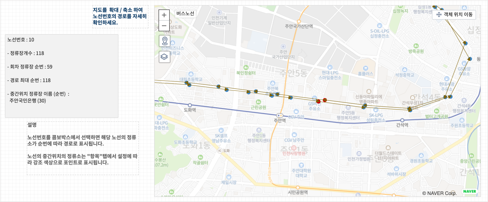

**데이터 설정**

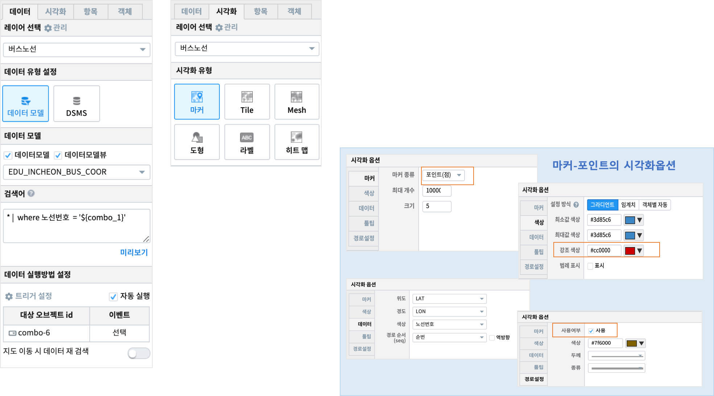

| 콤보박스를 트리거 설정한 뒤에 콤보박스 변수 combo_1 에 저장되는 "노선번호" 필드로 필터링한 데이터를 가져옵니다.

**시각화 설정**

| 마커-포인트로 시각화유형을 설정합니다.
| 시각화옵션에서 노선번호의 정류소의 위,경도 좌표에 해당하는 데이터 필드를 설정하고, 경로 순서에 해당하는 필드를 지정합니다. 
| 색상 텝에서 정류소의 포인트 색상을 지정합니다. 

| 이 때 중간기점의 정류소의 포인트 색상은 강조 색상으로 표시해주려고 강조색상을 따로 지정합니다.
| 시각화옵션의 "경로설정" 탭에서 사용을 체크하고, 화살표 라인의 색상을 지정합니다.

**항목 설정**

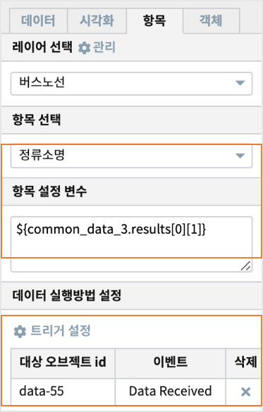

| 버스노선 레이어의 데이터중에서 **항목 선택** 에 선택된 “정류소명” 필드의 값과 **항목설정 변수** 에 입력한 common_data_3 의 값(정류소명) 이 같은 경우에는 
마커의 시각화옵션의 ”강조색상” 으로 지도에 표현됩니다. 
| 항목탭은 트리거로 설정된 객체의 변수를 **항목설정 변수** 에 지정하고, 지정한 레이어의 필드중에서 비교할 필드는 **항목 선택** 에서 지정하여 값이 같을 때 지도에 **강조색상** 으로 표시하려고 사용합니다.

