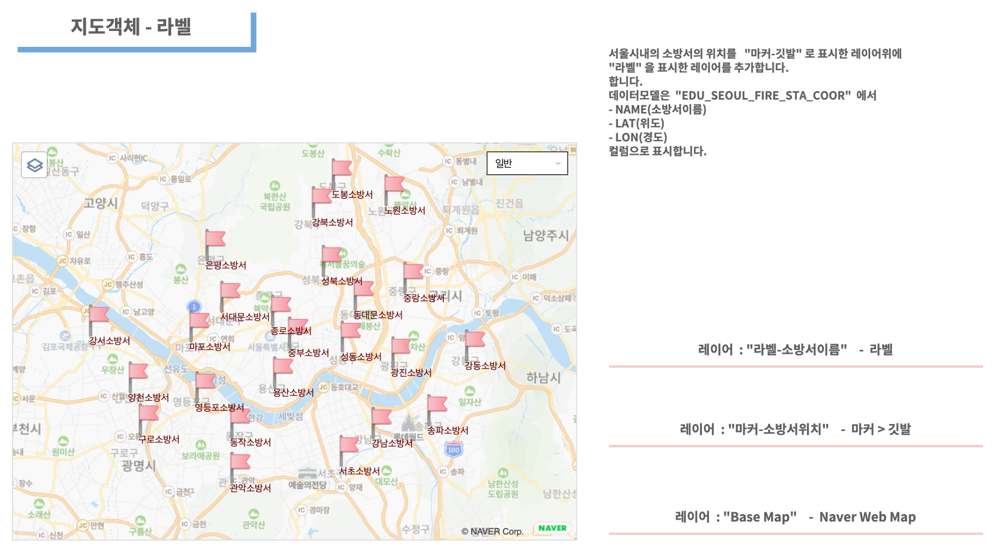

========================================================
지도유형 - 라벨
========================================================

| 지도유형 ``라벨`` 은 데이터의 위,경도 좌표 지점의 라벨(text) 로 표시할 수 있습니다.
| 라벨 레이어는 주로 마커나 도형 레이어 위에 특정 위치 좌표에 라벨에 해당하는 값을 표시합니다.
|
| 예제는 서울시 소방서위치를 "마커-깃발" 로 만든 레이어위에 "라벨" 로 레이어를 추가합니다.
|

**라벨**

|
- 데이터
    - 데이터모델 "EDU_SEOUL_FIRE_STA_COOR" 
    - 서울시 내의 소방서 코드(CODE), 소방서 이름(NAME), 위도(LAT), 경도(LON) 정보가 있습니다.
|  
- 레이어 구성
    - ``Base Map``   : Naver Web Map
    - ``마커-소방서위치``  : 마커 종류 - 깃발
    - ``라벨-소방서이름``  : 라벨

