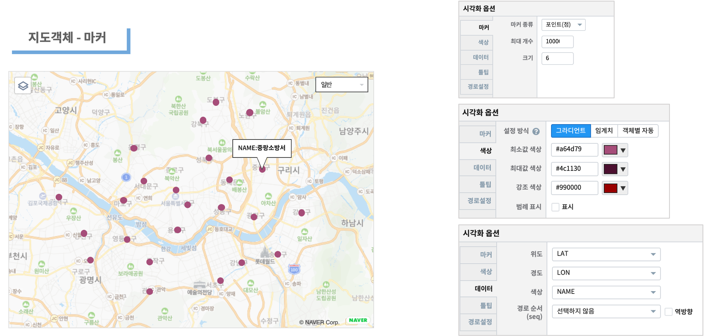
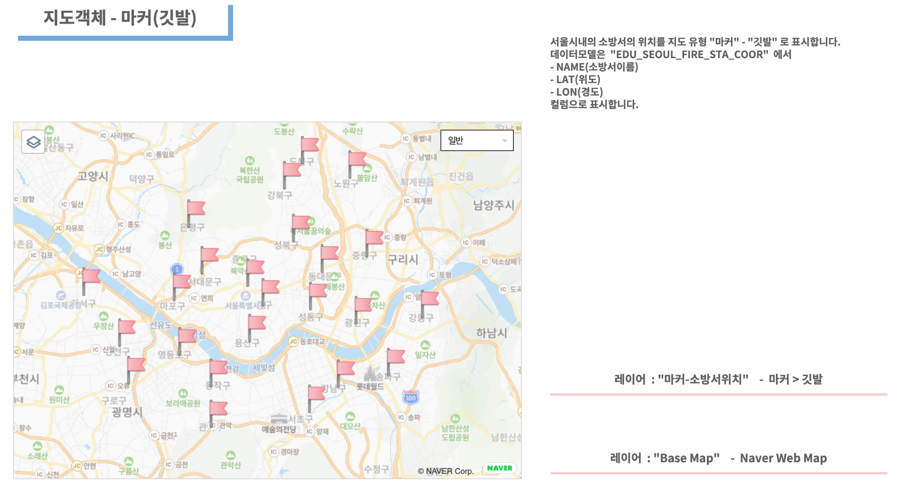

========================================================
지도유형 - 마커
========================================================

| 지도유형 ``마커`` 는 데이터의 위,경도 좌표 지점을 지도상에 포인트 또는 깃발로 표시할 수 있습니다.
|

**마커-포인트(점)**

|
- 데이터
    - 데이터모델 "EDU_SEOUL_FIRE_STA_COOR" 
    - 서울시 내의 소방서 코드(CODE), 소방서 이름(NAME), 위도(LAT), 경도(LON) 정보가 있습니다.
|  
- 레이어 구성
    - ``Base Map``   : Naver Web Map
    - ``마커-소방서위치``  : 마커 종류 - 포인트(점)

|
**마커-깃발**

|
- 레이어 구성
    - ``Base Map``   : Naver Web Map
    - ``마커-소방서위치``  : 마커 종류 - 깃발
