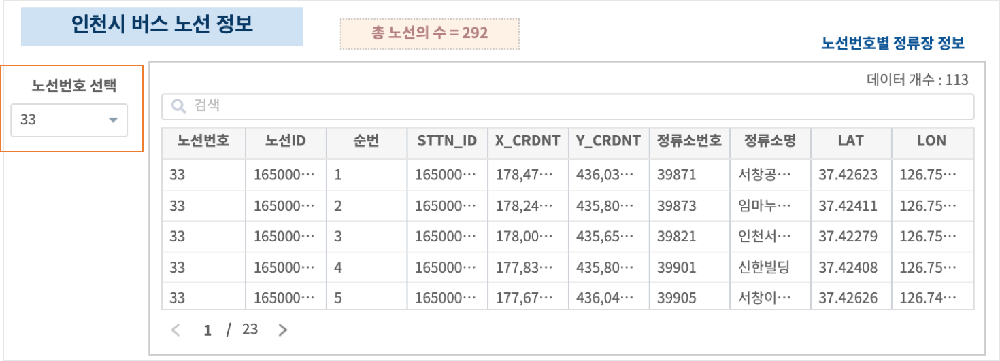
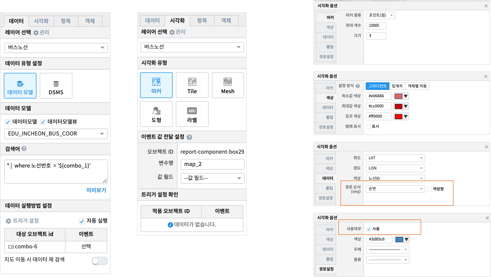

========================================================
마커 - 경로설정 예시
========================================================

| 지도의 시각화유형에서 "마커" 를 선택하면 위,경도 좌표 지점을 포인트 또는 깃발로 지도에 표시할 수 있습니다.
| 마커로 지도에 표현하는 데이터중에서 순번(sequence) 컬럼이 있는 경우에는 각 마커 지점과 지점사이를 화살표 라인으로 ``경로 표시`` 가 가능합니다.

.. contents::
    :backlinks: top

----------------------------------
데이터
----------------------------------

| 공공데이터  `인천광역시 버스노선별 정류장 현황 <https://www.data.go.kr/data/15048265/fileData.do>`__  에서 csv 파일을 다운로드합니다. 

.. image:: ./images/map_seq_08.png
    :alt: map seq 08

| 원본 데이터에는 위, 경도 좌표가 X_CRDNT, Y_CRDNT 로 ``epsg:5174`` 좌표계로 표시되어 있습니다.
| IRIS 에서는 ``epsg:4326`` 좌표계를 사용하므로 좌표계를 변환한 LAT, LON 컬럼을 추가합니다. 
| 
| LAT, LON 컬럼을 추가한 데이터 파일을 ``IRIS Discovery >> 파일 브라우저`` 의 MINIO 에 업로드 한 후 데이터모델 **EDU_INCHEON_BUS_COOR**  로 생성합니다.
|
| 버스 정류장은 마커(포인트) 로 지도에 표시합니다.
| 콤보박스에서 노선번호를 선택한 후, 해당 노선의 정류장 좌표를 마커(포인트)로 표시하고, 마커의 경로설정 기능을 check 하여 화살표 라인으로 정류장 순번을 표시합니다.

--------------------------------------------------------------------------------
버스 노선 레이어
--------------------------------------------------------------------------------

| 콤보박스에서 버스 노선번호를 선택합니다.
| 노선번호로 필터링된 데이터를 보면 해당 버스가 지나가는 정류소별로 순차적으로 번호가 매겨져 있는 **순번** 컬럼이 보입니다.

| 데이터에 순서가 있는 컬럼이 있는 경우, 마커유형에서 경로설정을 통해 마커지점과 지점을 화살표로 연결할 수 있습니다.

