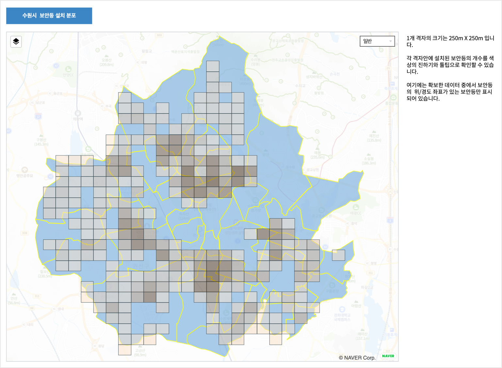
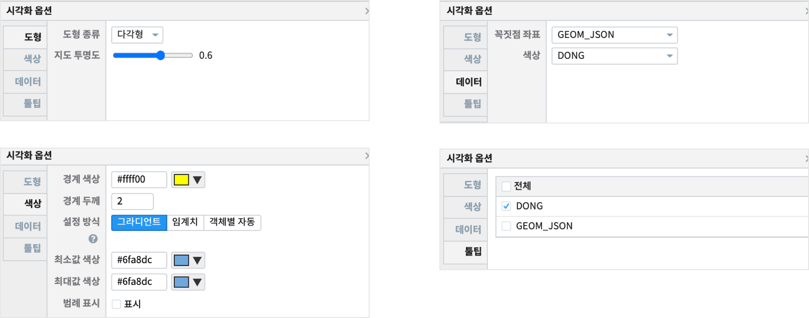
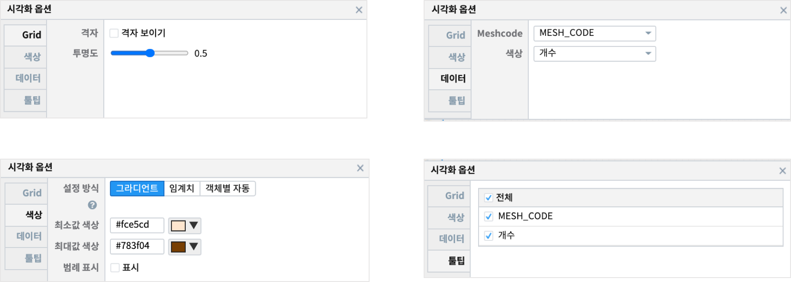
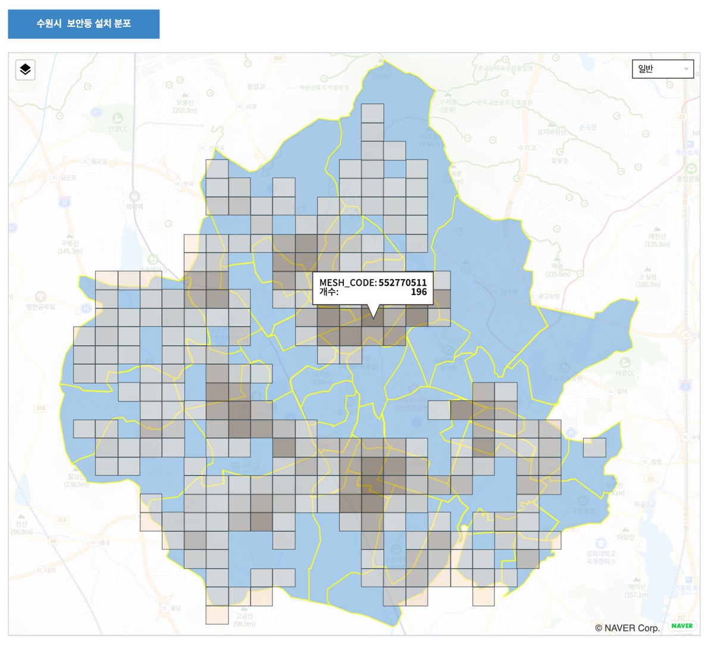

================================================================================
Mesh 유형 지도와 Mesh code 생성 방법
================================================================================

| 보고서 : `EDU_MAP_MESH_0.5_수원_보안등 <http://b-iris.mobigen.com:80/studio/exported/8a7d817e1b9e408d905f2e7d142f84c1ae9e482c528d412b9a97d54c9908b194>`__  
| 
| 지도의 mesh 시각화 유형은 Tile 유형과 유사하지만, 더 작은 영역을 적용할 수 있습니다.
| Mesh code는 위도 · 경도에 의해 80km에서 125m 까지의 격자 구획으로 세분이 가능하며,
| 주로 각 구획별 측정값, 통계의 기준이 됩니다.
| 지도에 표현되는 코드 데이터는 jpMesh 로 생성하여 그립니다. 
| 참조 : `python 패키지 pyjpmesh <https://pypi.org/project/pyjpmesh/>`__  , `R 라이브러리 jpmesh <https://cran.r-project.org/web/packages/jpmesh/index.html>`__
|
| 예제는 각 500m X 500m 격자에서 보안등의 갯수를 통계낸 값을 격자의 색상으로 표현한 예입니다.

| 

.. contents::
    :backlinks: top

------------------------------------------------------------------------------------------------------
보고서 개요 : 수원시 보안등 설치 분포
------------------------------------------------------------------------------------------------------

| 수원시의 행정동단위로 경계를 그린 지도 위에 500m X 500m 의 격자를 그립니다.
| 해당 격자안에 설치된 보안등의 개수를 구해서 보안등 설치 개수에 따라 격자의 색상을 표현합니다.
| 참고로 데이터는 2019년 3월의 수원시 보안등 설치 정보 데이터로 14657개의 보안등 정보 중 10321개를 지도에 표시한 것입니다.
| 보안등 설치 주소만 있고, 위, 경도 좌표가 없는 것은 제외하고 처리하였습니다.

'''''''''''''''''''''''''''''''''''''''''''''''''''''''''''''''''''''
데이터 준비 : Mesh 코드 생성
'''''''''''''''''''''''''''''''''''''''''''''''''''''''''''''''''''''

- 데이터 모델 EDU_MAP_SUWON_SECURITY_LAMP 
    - 총 14657 건
    - 수원시내에 설치된 보안등의 설치 주소와 위,경도 좌표가 있는 데이터
    - 다운로드는 Analyzer 메뉴에서 데이터모델로 전체 조회 후 **내보내기** 에서 **TSV** 파일로 저장합니다.

- 데이터 모델 EDU_MAP_MESH_half_SUWON_LAMP
    - 총 10321 건
    - 보안등 설치 장소에 대한 위,경도 좌표를 기준으로 500m X 500m 격자를 그리는 JpMesh 코드(MESH_CODE) 정보를 추가한 데이터
    - JpMesh code 생성 라이브러리 :  `python 패키지 pyjpmesh <https://pypi.org/project/pyjpmesh/>`__ 

- code 예제 (python) 

.. code::
 
    from jpmesh import Angle, Coordinate, FirstMesh, SecondMesh, ThirdMesh, HalfMesh
    
    lat_degree = 37.331073
    lon_degree = 127.014706

    coordinate = Coordinate(
        lon=Angle.from_degree(lon_degree), lat=Angle.from_degree(lat_degree))
    
    # 1/2 mesh (jpmesh.HalfMesh class, about 500 m square)

    mesh_class = "HalfMesh"
    level = 0.5

    mesh_code = HalfMesh.from_coordinate(coord).code

'''''''''''''''''''''''''''''''''''''''''''''''''
레이어 : 수원동경계 
'''''''''''''''''''''''''''''''''''''''''''''''''

- 데이터 모델  EDU_MAP_SUWON_DONG_CORR 
- 검색어 
    - "태장동" 이 2019년 4월에 망포1,2동으로 분동되었는데, 망포1,2동과 함께 포함되어 있어서 제외시킵니다.

.. code::

  * |  where DONG != '태장동'

- 시각화 유형은 도형
- 시각화 옵션 

'''''''''''''''''''''''''''''''''''''''''''''''''
레이어 : 보안등정보
'''''''''''''''''''''''''''''''''''''''''''''''''

- 데이터 모델  EDU_MAP_MESH_half_SUWON_LAMP
- 검색어 
    - 격자안에 포함된 보안등의 개수를 구합니다.

.. code::

  * | stats sum(INSTALLATION_COUNT) as 개수 by MESH_CODE

- 시각화 유형 Mesh
- 시각화 옵션

- 툴팁으로 격자별 통계값 확인이 가능합니다. 여기서는 격자(500m X 500m) 안에 등록된 보안등의 개수를 알 수 있고, 개수컬럼을 격자의 색상으로 표시하면 분포를 시각적으로 확인할 수 있습니다.

    
