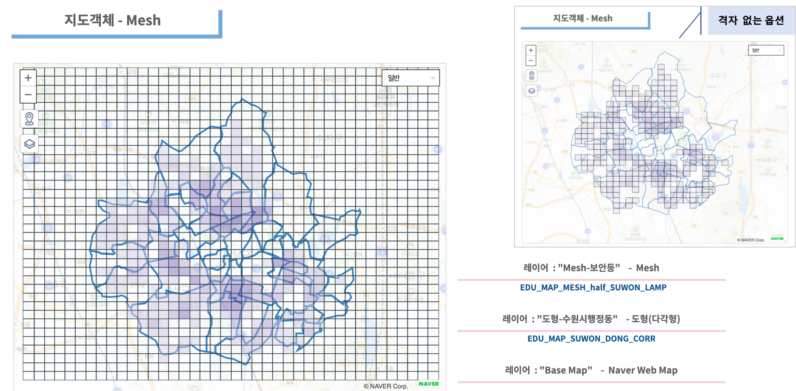

========================================================
지도유형 - Mesh
========================================================

| IRIS Studio 에서 지도객체 ``Mesh`` 시각화 유형은 Tile 유형과 유사하지만, 더 작은 영역을 적용할 수 있습니다.
| Mesh code는 위도/경도에 의해 80km에서 125m 까지의 격자 구획으로 세분이 가능하며, 각 구획별로 구한 통계값이나 측정값으로 구획의 색을 표현합니다.

| 지도에 표현되는 Mesh code 는 jpMesh 라이브러리로 생성하여 그립니다.
| `Mesh 코드 생성 <https://docs.iris.tools/manual/IRIS-Tutorial/IRIS_Studio/02_map_exam/map_mesh.html?highlight=mesh#mesh-mesh-code>`__  을 참고하세요.

|
**Mesh**

|
- 데이터
    - 데이터모델 "EDU_MAP_SUWON_DONG_CORR" 로 경기도 수원시의 행정동을 표시합니다.
    - 데이터모델 "EDU_MAP_MESH_half_SUWON_LAMP" 에는 수원시에 설치된 보안등의 위,경도 좌표와 mesh code 를 계산한 값이 들어 있습니다.

|  
- 레이어 구성
    - ``Base Map``   : Naver Web Map
    - ``도형-수원시행정동``  : 도형-다각형
    - ``Mesh-보안등``  : Mesh

- 레이어 ``Mesh-보안등`` 은 MESH_CODE 별로 보안등 설치 개수를 집계한 값을 색상값으로 설정합니다.

.. code::

    * | stats sum(INSTALLATION_COUNT) as 개수 by MESH_CODE

    # 개수 = MESH_CODE 별로 보안등 설치 개수를 집계한 값
