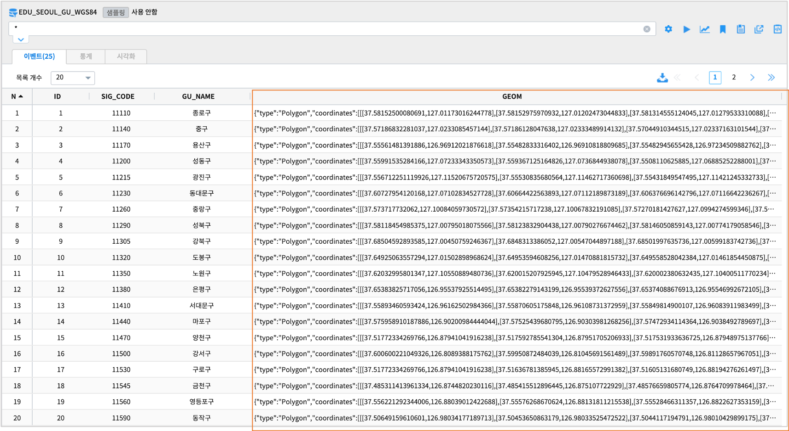
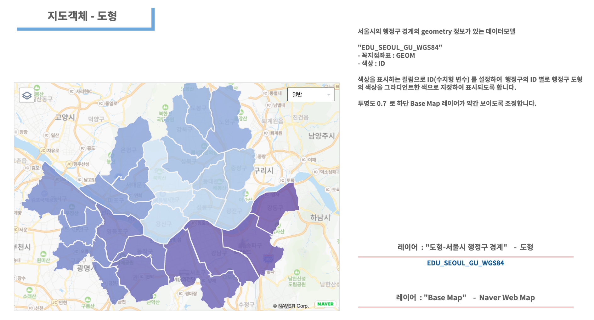

========================================================
지도유형 - 도형(다각형)
========================================================

| 지도유형 ``도형`` 은 위/경도 좌표인 꼮지점을 연결하여 만든 ``다각형`` 으로 지도에 표시됩니다.
| 데이터모델에 geometry 컬럼 ``"type" : "Polygon","coordinates":...``  가 포함되어 있어야 합니다.
|

**도형**

|
- 데이터
    - 데이터모델 "EDU_SEOUL_GU_WGS84" 
    - 번호(ID), 서울시 내의 행정구 코드(SIG_CODE), 행정구 이름(GU_NAME), 행정구경계 geometry(GEOM)

|  
- 레이어 구성
    - ``Base Map``   : Naver Web Map
    - ``도형-서울시 행정구 경계``  : 도형

| 
- 시각화옵션
    - 도형을 다각형으로 설정
    - 투명도 조정하여 Base Map 이 약간 보이게 합니다.
    - 수치형 변수인 ID 의 크기에 따라 도형의 색상을 그라디언트로 표시합니다.

