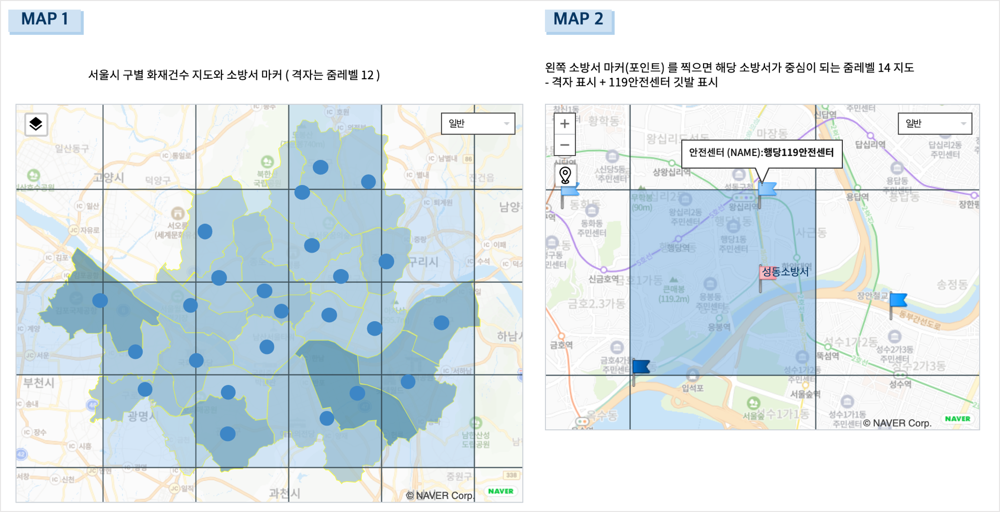
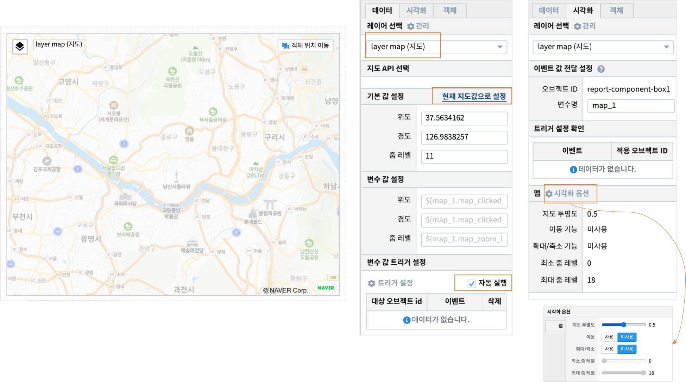
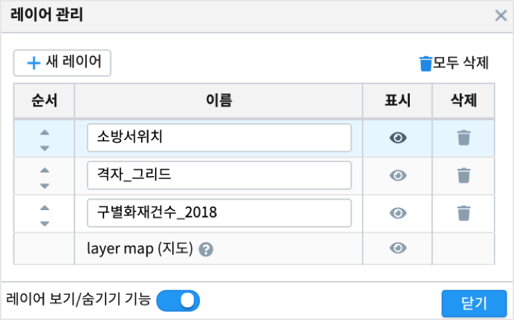
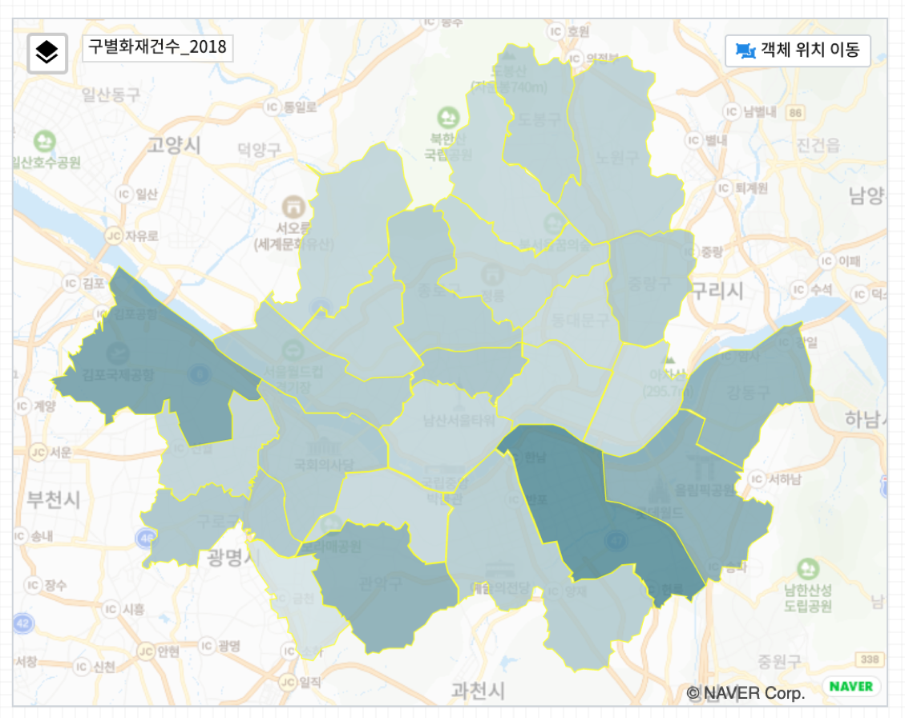
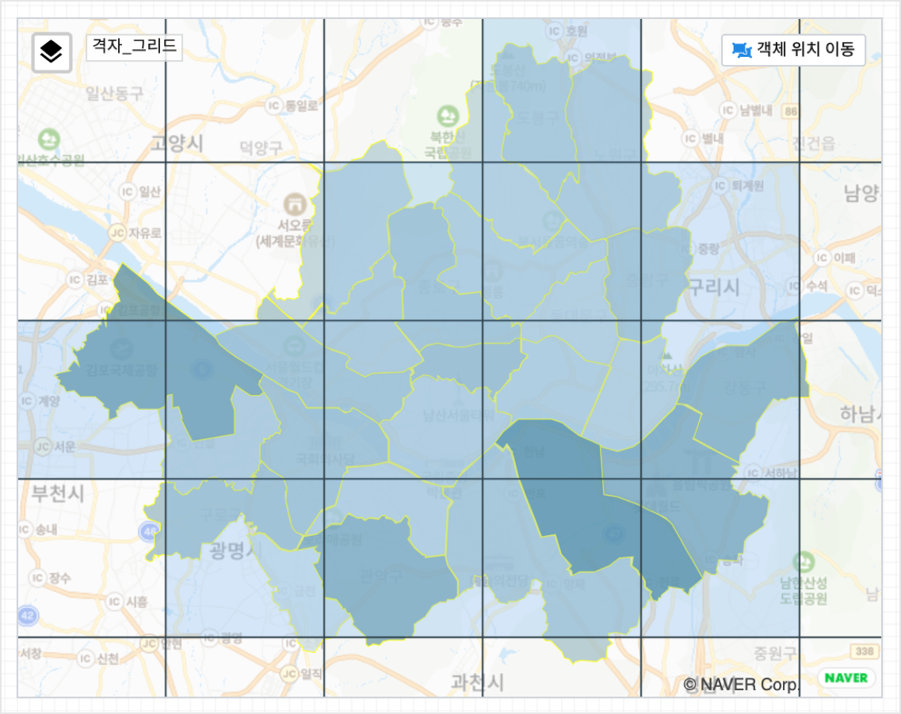
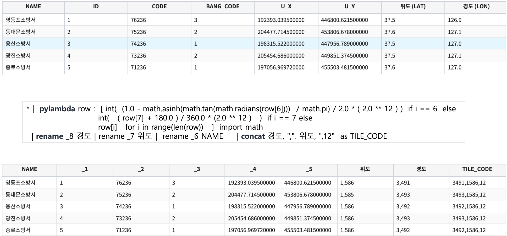
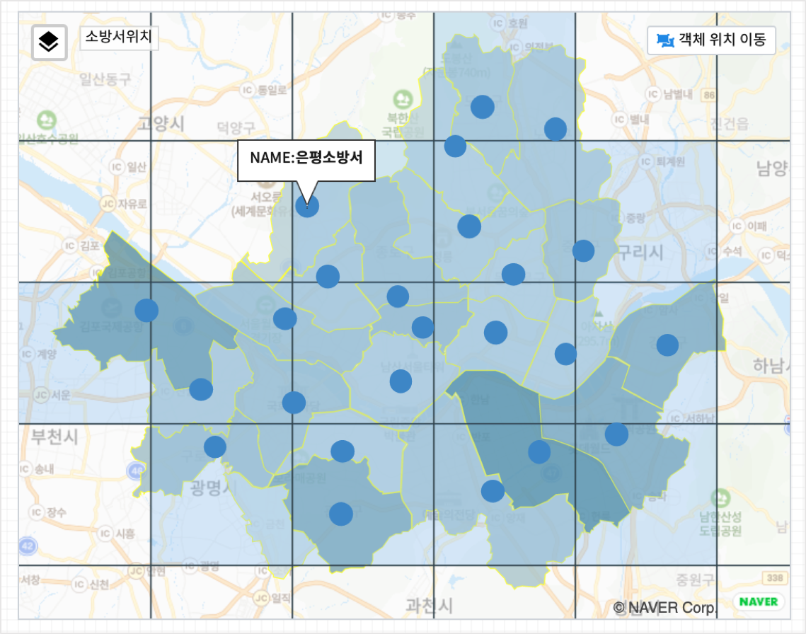

================================================================================
MAP 1 : tile / 도형 / 마커
================================================================================

| 보고서 : `EDU_MAP_Tile_Seoul_FireCenter <http://b-iris.mobigen.com:80/studio/exported/69e9c280245a4771b45e7328d8f9fcd047660cf8ff7240a6909d13fff5a84140>`__ 
| 
|
| 2018년 서울시 구별 화재건수 데이터와 소방서 위,경도 데이터를 3개의 레이어로 지도에 표시하는 보고서 예제입니다.
| 
| **구별화재건수-2018** 레이어에서는 지도의 시각화유형 중 **도형-Polygon** 으로 행정구 경계를 표시하고, 색상의 진하기로 2018년 구별 화재건수를 표현합니다.
| **격자_그리드** 레이어에서는 지도의 시각화유형 중 **Tile** 로 소방서위치 기준으로 zoom 레벨 12 로 격자를 생성합니다.
| **소방서위치** 레이어에서는 서울시 소방서의 위/경도 좌표를 시각화유형 **마커** 로 포인트로 지도에 표시합니다.

| "MAP 1" 의 소방서 포인트를 클릭하면 옆의 다른 지도 "MAP 2" 에서 해당 소방서를 중심으로 확대된 지도(zoom 레벨 14)로 표시되고, 해당 소방서와 주변 119안전센터가 같이 표시됩니다.
| 여기서는 "MAP 1" 그리기를 설명합니다.

| 

.. contents::
    :backlinks: top

------------------------------------------------------------------------------------------------------
MAP 1 : 도형 / 마커 
------------------------------------------------------------------------------------------------------

layer map 
'''''''''''''''''''''''''''''''''''''''''

- 기본 레이어 layer map(지도) : 지도 API는  네이버지도를 선택하고, 서울시가 지도에 다 표현되게 지도 이동을 합니다.
- **데이터** 탭에서 "현재 지도값으로 설정" 으로 현재 위,경도 좌표로 지도가 표현되도록 설정하고, "자동 실행" 을 선택합니다.
- **시각화** 탭에서 시각화옵션을 클릭하여 시각화옵션 창에서 "지도 투명도" 를 낮춰서 배경 지도가 흐리게 보이도록 합니다.
    - 이동 기능, 확대/축소 기능을 "미사용" 으로 선택하여 지도위에서 고정이 되도록 합니다.

- **레이어 관리** 창을 열어서 필요한 레이어를 "새 레이어" 를 클릭하여 추가합니다.

지도 시각화유형 : 도형 (Polygon)
'''''''''''''''''''''''''''''''''''''''''

| 지도의 시각화유형 중 **도형-Polygon** 으로 행정구 경계를 표시하고, 색상 변화를 통해 2018년의 구별 화재건수를 표현합니다.

- 레이어 
    - 구별 화재건수_2018

- 데이터탭
    - 데이터 모델 EDU_SEOUL_GU_FIRE_CAUSE
        -  서울시 구별로 화재 원인별 발생 건수 통계(연간 통계)
    - 검색어 
        - 2018년 데이터로 필터링
        - EDU_SEOUL_GU_WS84 데이터모델과 join 하여 행정구 경계(EDU_SEOUL_GU_WGS84.GEOM 컬럼)를 표시하고, 구별 화재건수에 따라 색을 표시합니다.
        - 데이터 모델 EDU_SEOUL_GU_WS84 을 Analyzer 화면이나 Studio 의 챠트-테이블 에서 조회해보시기 바랍니다. 
          행정구 경계에 대한 데이터인 GEOM 컬럼의 내용이 어떤 식으로 되어 있는지 확인 할 수 있습니다.

.. code::
  
  * YEAR=2018  | 
  join LEFT_OUTER  EDU_SEOUL_GU_WGS84  EDU_SEOUL_GU_WGS84.GU_NAME = EDU_SEOUL_GU_FIRE_CAUSE.GU_NAME | 
  rename TOTAL 화재건수

- 시각화탭
    - 시각화 유형은 **도형** 선택
    - 시각화옵션을 설정합니다. 도형-색상-데이터-툴팁

지도 시각화유형 : Tile
'''''''''''''''''''''''''''''''''''''''''

| 지도의 시각화유형 중 **Tile** 로 소방서위치 기준으로 zoom 레벨 12 로 격자를 생성합니다.

- 레이어 이름 
    - 격자_그리드
- 데이터 탭
    - 데이터 모델 EDU_TILE_SEOUL_FIRE_STATION_COOR  
        - 격자를 표시하기 위한 정보인 TILE_CODE컬럼이 있는 데이터

- 시각화 
    - 시각화유형은 Tile

.. image:: ./images/studio_map_07.png
    :alt: map tile 07

**Tile CODE 만들기**

| 데이터모델 EDU_SEOUL_FIRE_STA_COOR 는 서울시 소방서의 위,경도 좌표가 있는 데이터입니다.
| 이 모델에서 IRIS DSL 로 TILE_CODE 를 생성하는 검색어 예시입니다.

.. code::

  * |  pylambda row :  [ int(  (1.0 - math.asinh(math.tan(math.radians(row[6])))  / math.pi) / 2.0 * ( 2.0 ** 12 ) )  
         if i == 6  else  
                         int(   ( row[7] + 180.0 ) / 360.0 * (2.0 ** 12 )   ) 
         if i == 7 else row[i]   for i in range(len(row))   ]  import math 
    | rename _8 경도 | rename _7 위도 |  rename _6 NAME 
    | concat 경도, ",", 위도, ",12"  as TILE_CODE

지도 시각화유형 : 마커
'''''''''''''''''''''''''''''''''''''''''

| 서울시 소방서의 위/경도 좌표를 시각화유형 **마커** 로 포인트로 지도에 표시합니다.

- 레이어 이름
    - 소방서위치
- 데이터탭
    - 데이터 모델 EDU_SEOUL_FIRE_STA_COOR
        - 소방서의 위,경도 좌표가 있는 데이터
- 시각화 
    - 시각화유형은 마커-포인트

 .. image:: ./images/studio_map_10.png
    :alt: map tile 10   

