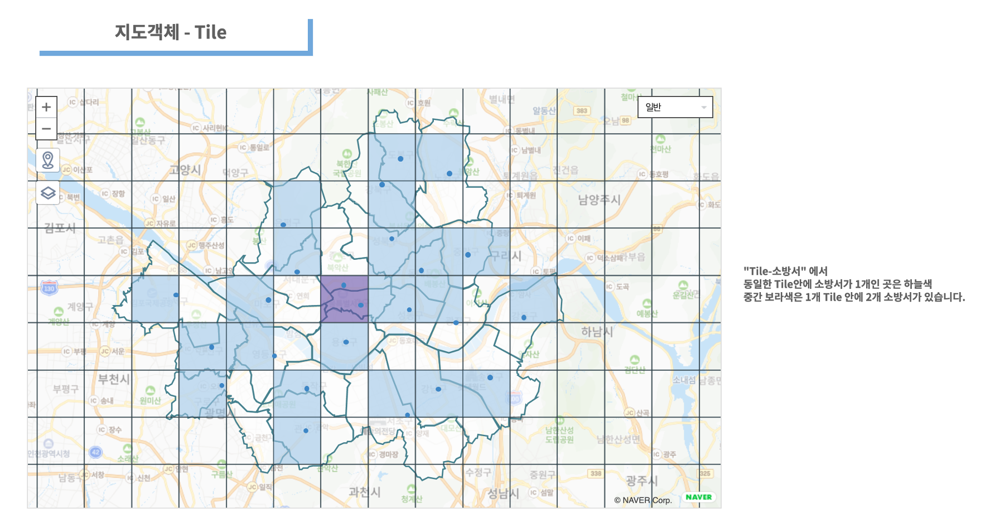
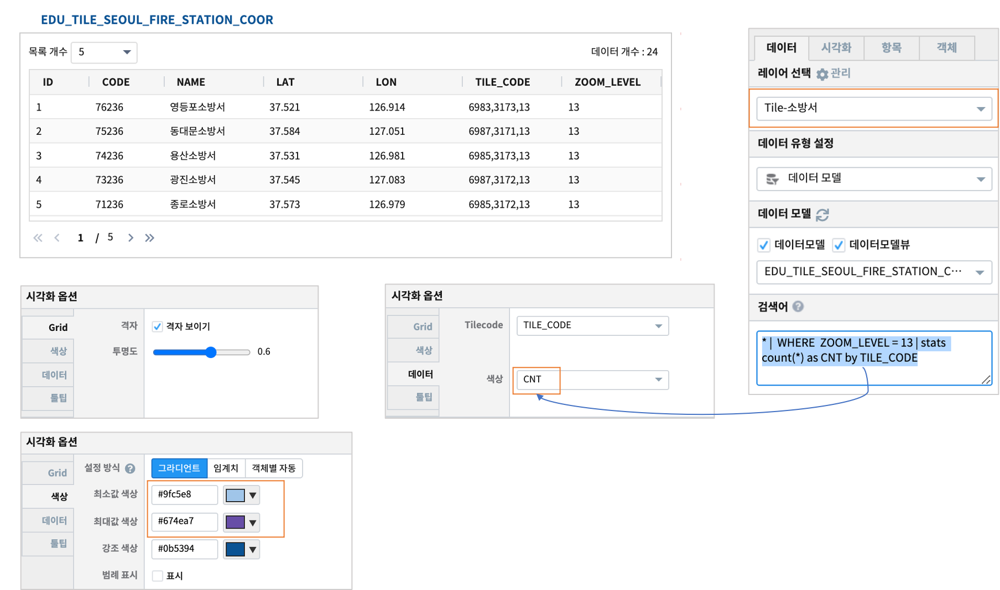

========================================================
지도유형 - Tile
========================================================

| 지도 검색 및 표시의 성능을 최적화 하기위해 지도는 사각형 타일로 나눕니다.
| 줌레벨 1은 4개의 타일을 사용하여 전 세계를 2x2 사각형으로 렌더링합니다.
| 예를 들어 줌레벨 4는 이전 레벨의 타일을 분할하여 ``2의 4승`` x ``2의 4승``  의 그리드를 만듭니다.
|
| - 참고  : 지도의 타일 개념은 `MicroSoft Azure Maps 확대/축소 수준 및 타일 그리드 <https://docs.microsoft.com/ko-kr/azure/azure-maps/zoom-levels-and-tile-grid?tabs=csharp>`__  사이트를 참조하시기 바랍니다.
|
| 지도에서 ``Tile`` 유형은 일정한 줌레벨의 타일안에 포함되어 있는 지점의 수와 특성값 등 을 보여줄 때 사용할 수 있습니다.
| 예제는 서울시 소방서의 위치좌표를 토대로 **줌레벨=13** 일 때의 타일코드를 계산하여, 1개의 타일안에 소방서가 어떻게 분포되어 있는지 지도에 표시합니다.
| 그리고 1개의 타일안에 포함된 소방서 개수를 타일의 색상으로 표시합니다.
|
**Tile**

|
- 데이터
    - 데이터모델 "EDU_SEOUL_GU_WGS84" 로 서울시와 서울시 행정구 경계를 표시합니다.
    - 데이터모델 "EDU_TILE_SEOUL_FIRE_STATION_COOR" 에는 소방서의 위/경도 좌표와 해당 좌표의 tile code(줌레벨 13)가 계산되어 있습니다.

|  
- 레이어 구성
    - ``Base Map``   : Naver Web Map
    - ``도형-서울구경계``  : 도형-다각형
    - ``Tile-소방서``  : Tile
    - ``마커-서울소방서위치``  : 마커(포인트)

| 
-  레이어 : Tile-소방서

| 1개의 tile code 안에 여러개의 소방서가 있으면 tile 색상이 최대값색상에 가깝게 진해집니다.
|

.. code::

    * |  WHERE  ZOOM_LEVEL = 13 | stats count(*) as CNT by TILE_CODE
