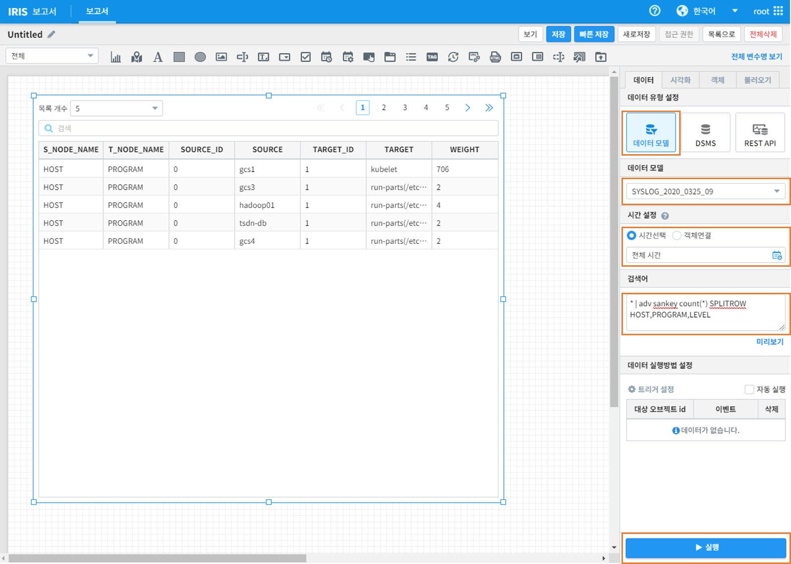

==================================================
Sankey 차트
==================================================

| Sankey 차트를 활용하여 각 변수간의 데이터의 흐름을 나타내는 관계형 그래프를 그릴 수 있습니다. 그래프의 연결선 굵기는 데이터의 양을 표현합니다. 

---------------------------------
사용 데이터
---------------------------------

| Sankey 차트를 활용하여 보고서를 구성할 데이터는 다음과 같이 확인할 수 있습니다. 
| IRIS Analyzer로 진입하여 해당 데이터를 검색합니다. Sankey 차트는 그림에 나오는 데이터를 활용하여 해당 데이터를 HOST별로 묶어 관련된 PROGRAM으로 연결하고, 연결된 데이터의 결과를 LEVEL별로 묶어 그래프로 그려줍니다

.. image:: ./images/sankey-1.png
        :alt: sankey 기초데이터

---------------------------------
Sankey 차트 그리기
---------------------------------

| 확인한 데이터를 바탕으로 Sankey 차트를 그려 보겠습니다.
| IRIS Studio - 새 보고서를 선택하여 진입 후 차트를 선택하고 원하는 크기의 그래프 창을 그려줍니다. 

.. image:: ./images/sankey-2.png
        :alt: sankey 기초데이터

| 데이터 모델 선택 후 '시간'을 전체선택 하고 검색어를 다음과 같이 입력합니다(`adv <http://docs.iris.tools/manual/IRIS-Manual/IRIS-Discovery-Middleware/command/commands/adv.html>`_ 명령어의 자세한 활용법은 링크를 참조하세요)

.. code::

    * | adv sankey count(*) SPLITROW HOST,PROGRAM,LEVEL

| 명령어의 수행 결과로 아래와 같은 차트 데이터를 확인할 수 있습니다. 

| 우측 옵션창에서 '시각화'->'Sankey'를 선택하면 차트의 영역에 Sankey 차트가 그려집니다. 

.. image:: ./images/sankey-4.png
        :alt: sankey 기초데이터

