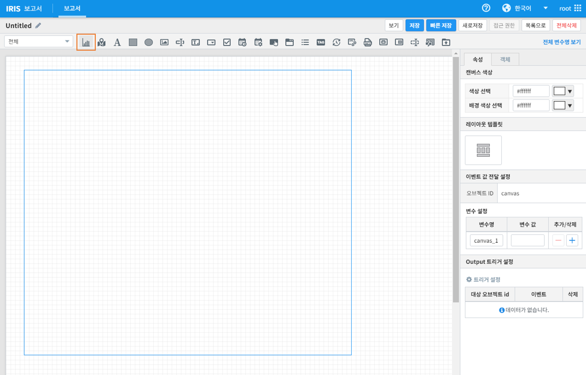

==================================================
모션 차트
==================================================

| 모션차트는 시간에 따른 데이터를 X축으로 구성하고 해당 값을 Y축으로 구성하여 시간의 흐름에 따라 데이터 양의 변화를 버블의 크기로 나타내는 차트입니다. 
| 또한 사용자는 재생, 일시정지, 다시 재생, 중단 기능을 통해 시간 흐름별 데이터의 움직임을 동적으로 파악할 수 있습니다. 

---------------------------------
사용 데이터
---------------------------------

| 시간의 흐름에 따른 각 나라별 인구 데이터를 예제로 작성하겠습니다. 
| 모션 차트를 그릴 데이터는 인구 1억명 이상의 국가로 필터링하였습니다. 모션차트의 각 데이터는 그룹 변수를 제외하고 모두 숫자형 데이터 타입으로 구성되어야 합니다. 

---------------------------------
모션 차트 그리기
---------------------------------

| IRIS Studio - 새 보고서를 선택하여 진입 후 차트를 선택하고 원하는 크기의 그래프 창을 그려줍니다. 

| 데이터 모델 선택 후 '시간'을 전체선택 하고 검색어를 다음과 같이 입력합니다.

.. code::

    * | WHERE population > 100000000

| 명령어의 수행 결과로 아래와 같은 차트 데이터를 확인할 수 있습니다. 

.. image:: ./images/motion-2.png
        :alt: 모션 기초데이터

| 우측 옵션창에서 '시각화'->'모션'을 선택하면 차트의 영역에 모션 차트가 그려집니다. 

.. image:: ./images/motion-3.png
        :alt: 모션 화면

| 모션 차트 좌측 상단의 4가지 버튼으로 재생/일시정지/다시 재생/중단 기능을 수행할 수 있습니다. 

