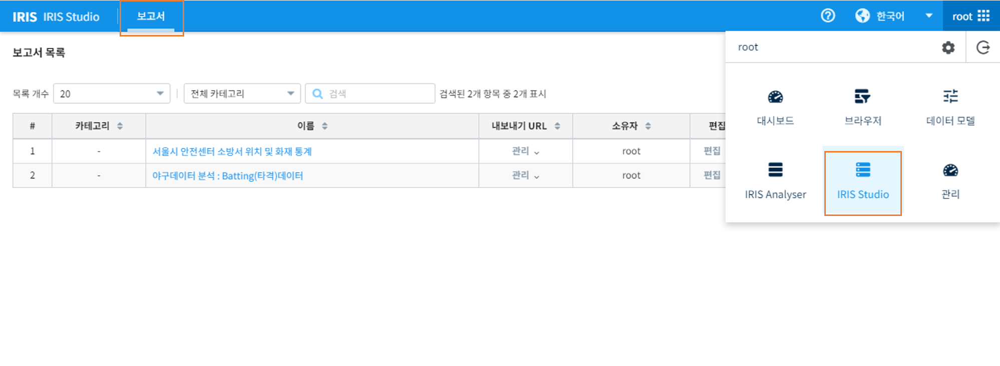

IRIS Studio
====================

IRIS Studio는 다양한 데이터 시각화 결과를 웹 문서로 작성할 수 있는 도구를 제공합니다. 
분석 결과를 보고서로 작성할 수 있으며 해당 분석기능을 활용하여 데이터소스 및 데이터 탐색 범위, 보고서 갱신 주기 등을 동적으로 변경할 수 있는 대시보드 화면 저작 등에 활용할 수 있습니다. 

.. toctree::
    :hidden:

    00_common/index.rst
    01_chart_exam/index.rst

