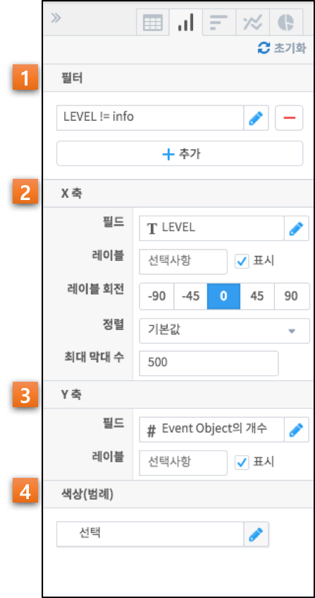
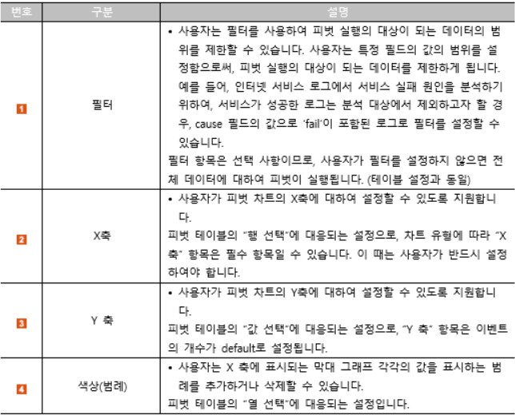

=========================
피벗 결과 분석하기: 차트
=========================
-------------------------
개요
-------------------------
| 이번 튜토리얼에서는 피벗 결과를 활용한 차트 분석에 대해 설명하겠습니다. 

------------------------- 
차트 기능 구성
-------------------------

| 차트 기능 구성은 다음과 같습니다.

-------------------------
분류에 대한 비교
-------------------------

| '분류'란 종류에 따라 가름이란 의미로 특정한 카테고리로 구분하고 이를 비교하는것을 의미합니다.
| 피벗 결과의 시각화에서 '분류에 대한 비교'는 각 항목간에 영향을 받지 않도록 구성해 서로의 절대적인 값을 표현합니다. 
| 이를 통해 피벗 분석으로 도출된 하나 또는 여러개의 결과 값을 특정 임계치나 다른 항목들과의 비교를 통해 사용자에게 통찰을 얻을 수 있도록 합니다.

막대 차트 - 세로막대형
===================================================================================================================================
막대 차트는 하나의 축을 기준으로 데이터를 시각화한 차트입니다.
데이터를 표현할 때 높이(또는 길이)로써 값을 표현하며, 이른 다른 값 또는 축과 비교합니다.
중점을 두고 관찰하고자 하는 항목에 대해 다른 색상을 이용하여 사용자의 시선을 끌 수 있으며 직관적으로 정보를 전달 할 수 있습니다.

리그별 득점 평균 피벗 테이블을 아래와 같이 형성 합니다.

.. image:: ./images/4_pic_4_03.png
    :alt: 피벗구성

우축 상단의 세로막대형 아이콘을 클릭해 리그별 득점 평균에 대한 비교를 세로 막대 차트로 나타냈습니다.

.. image:: ./images/4_pic_4_04.png
    :alt: 피벗구성

막대 차트 - 가로막대형
===================================================================================================================================
막대를 세로로 할 수도 있고 가로로 할 수도 있습니다. 
가독성 면에선 항목이 적을수록 가로가 좋고 항목이 많을수록 세로가 좋습니다.

리그별 득점 평균 피벗 테이블을 아래와 같이 형성 합니다.

.. image:: ./images/4_pic_4_05.png
    :alt: 피벗구성

우축 상단의 막대형 아이콘을 클릭해 리그별 득점 평균에 대한 비교를 가로 막대 차트로 나타냈습니다.

.. image:: ./images/4_pic_4_06_1.png
    :alt: 피벗구성

-------------------------
구성에 대한 비교
-------------------------

'구성'이란 몇 가지 부분이나 요소들을 모아서 일정한 전체를 이룬다는 뜻입니다.
'분류에 대한 비교'는 각 항목간에 영향을 받지 않도록 구성하여 서로의 절대적인 값을 표현합니다.

원형 차트 (Pie Chart)
===================================================================================================================================
원형 차트는 항목이 차지하는 비율을 표시하는데 유용한 차트입니다.

AL리그 팀 중 팀별 득점 합계 피벗 테이블을 아래와 같이 형성 합니다.

.. image:: ./images/4_pic_4_07.png
    :alt: 피벗구성

우축 상단의 원형 차트 아이콘을 클릭해 팀별 득점 합계에 대한 비율을 원형 차트로 나타냈습니다.

.. image:: ./images/4_pic_4_08.png
    :alt: 피벗구성

-------------------------
시계열 데이터의 평가
-------------------------

'시계열 데이터의 평가'는 시간이 경과함에 따라 일정한 간격을 기준으로 측정된 데이터를 평가 할 수 있는 차트를 의미합니다.
표현된 값에 대해 추세를 파악하고 미래의 상황을 예측하거나 현재에 대한 통찰력을 얻어 각종 의사결정을 하는데 도움을 받을 수 있습니다.

꺽은선 차트 (Line Chart)
===================================================================================================================================
꺽은선 차트는 자료의 흐름을 파악하고 비교할 때 유용합니다.

먼저 피벗 테이블을 활용해 2000년 이후 리그 별 평균 득점 추세를 확인 했습니다.

.. image:: ./images/4_pic_4_01.png
    :alt: 피벗구성

.. image:: ./images/4_pic_4_02.png
    :alt: 피벗구성

우축 상단의 꺽은선 차트 아이콘을 클릭해 2000년 이후 리그 별 평균 득점 추세를 한눈에 확인할 수 있습니다. 

