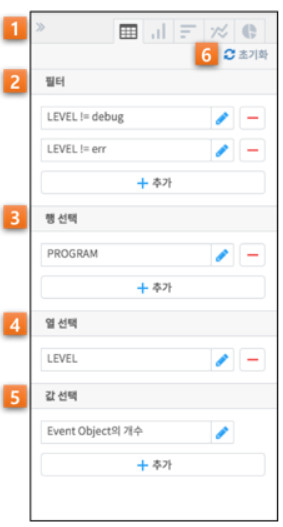
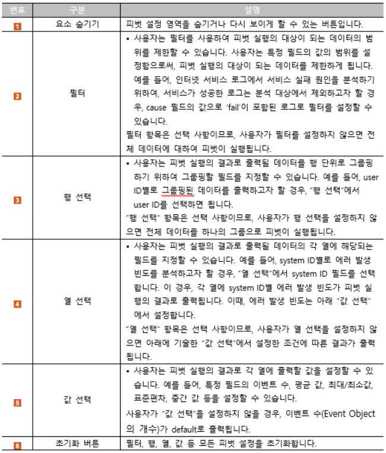
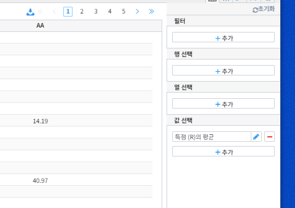

=========================
피벗 테이블 분석하기
=========================
-------------------------
개요
-------------------------
| 이번 튜토리얼에서는 피벗 테이블 분석에 대해 설명하겠습니다. 

--------------------------
피벗 테이블 관련 기능 구성
--------------------------

| 피벗 테이블 관련 기능 구성은 다음과 같습니다.

-------------------------
피벗 테이블 분석하기
-------------------------

기초 통계량 분석
===================================================================================================================================
사용자는 출력될 데이터를 특정 필드별로 그룹핑할 수 있습니다. 
사용자가 “행 선택”에서 특정 필드를 선택하면, 피벗 실행의 결과로 출력되는 각 행은 해당 필드별로 그룹핑됩니다. 

.. image:: ./images/2_pic_1_01.png
    :alt: 피벗구성

위와 같이 '행 선택'에 '리그 ID'를 추가하겠습니다.

'값 선택'에 '득점의 평균'를 추가 한뒤 우측 하단 '실행' 버튼을 클릭합니다.

.. image:: ./images/2_pic_1_02_1.png
    :alt: 피벗구성

위 피벗 같이 '리그 ID' 별 평균 득점을 확인 할 수 있습니다.

.. image:: ./images/2_pic_1_03.png
    :alt: 피벗구성

'값 선택'에 득점 최대값과 안타 평균을 추가해보겠습니다.

.. image:: ./images/2_pic_1_04.png
    :alt: 피벗구성

실행시 피벗 테이블 같이 '리그 ID' 별 평균 득점, 최대 득점, 평균 안타를 확인 할 수 있습니다.

열 선택 활용하기
===================================================================================================================================
열 선택을 활용해 사용자는 출력될 결과의 열에 해당되는 필드를 설정할 수 있습니다. 
열 선택은 Adjancy matrix를 만들거나 항복 별 통합 값을 같이 구할 때 좋습니다. 

.. image:: ./images/2_pic_1_05.png
    :alt: 피벗구성

위와 같이 연도를 행으로, 리그 ID를 열로 설정한 뒤 득점의 평균값을 보겠습니다.

.. image:: ./images/2_pic_1_06.png
    :alt: 피벗구성

실행시 결과는 위와 같이 나타납니다.

조건 설정 하기 (필터 기능)
===================================================================================================================================

사용자는 “필터” 항목에서 필터 조건을 설정할 수 있습니다.
오픈된 필드 리스트 중에서 필터 하고자 하는 필드를 선택하면, 선택한 필드의 유형에 따라 아래와 같은 필터 설정 popup이 오픈 되고, 리스트 박스에서 필터의 일치 조건을 선택할 수 있습니다. 
popup에서, 필드의 타입에 따라 아래와 같이 선택할 수 있는 일치 조건이 달라집니다.

.. image:: ./images/2_pic_1_07.png
    :alt: 피벗구성

위와 같이 필터 항목을 클릭해 리그 ID가 AL로 일치하도록 설정합니다.

.. image:: ./images/2_pic_1_08.png
    :alt: 피벗구성

.. image:: ./images/2_pic_1_09.png
    :alt: 피벗구성

시간별 트렌드 분석하기
===================================================================================================================================
막대 

