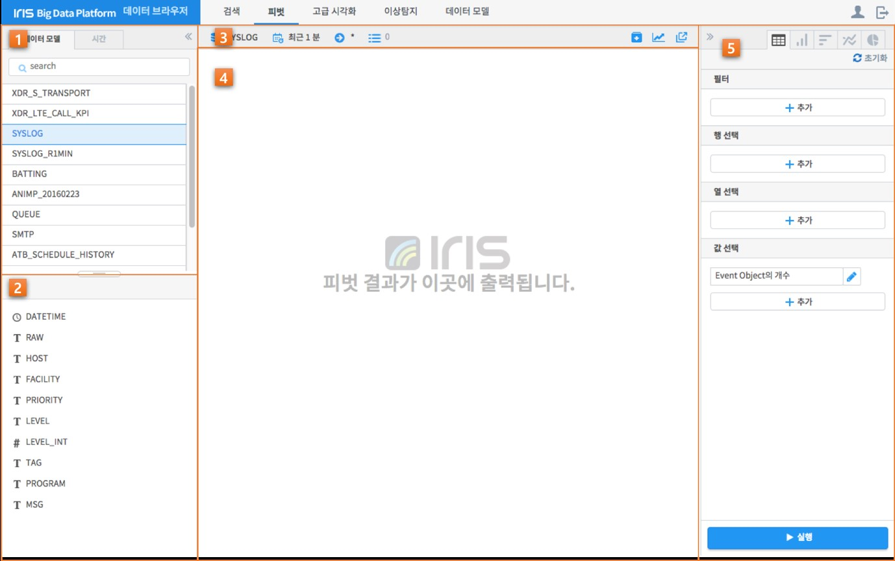
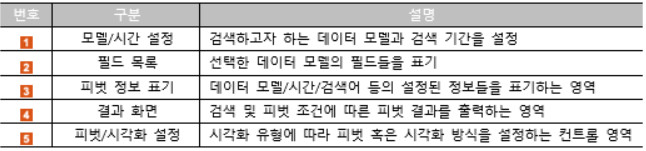
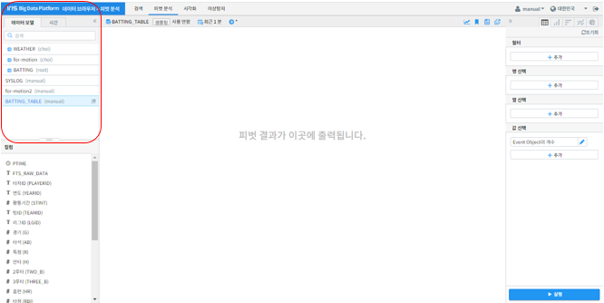
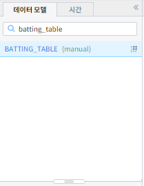
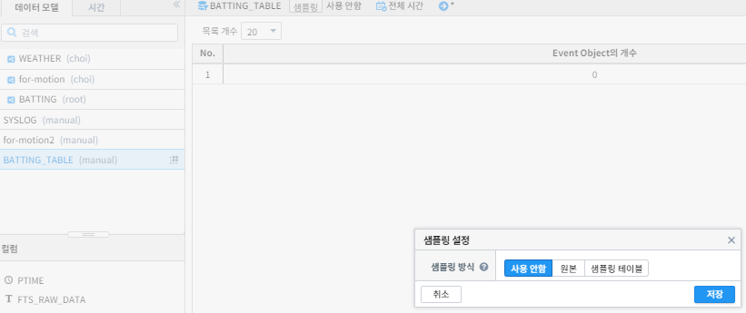
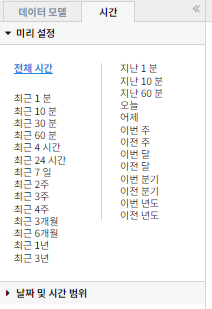
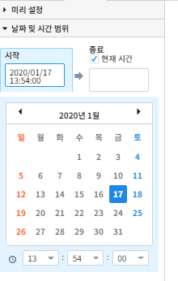
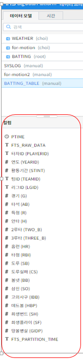
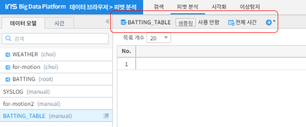
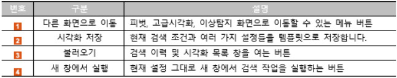

피벗분석
=========================
-------------------------
개요
-------------------------
| 피벗 기능은 사용자가 검색 결과의 각 필드를 행, 열, 값 등으로 적절히 조합함으로써 원하는 분석 결과를 쉽고 빠르게 도출하기 위한 강력한 분석 툴입니다.
| IRIS 데이터 브라우저는 사용자가 피벗 기능을 쉽게 사용할 수 있도록 직관적인 사용자 인터페이스를 제공합니다.
| 사용자는 데이터 검색과 분석을 위한 명령어에 대한 교육을 받지 않더라도 GUI 인터페이스를 통해 쉽게 피벗 기능을 사용할 수 있습니다.

1. 데이터 준비하기 
===================================================================================================================================
| 검색하고자 하는 조건에 맞는 데이터를 불러올 수 있습니다.
| 선택한 데이터의 필드 정보를 확인 할 수 있습니다.

-------------------------
1.1 피벗 화면 구성
-------------------------
피벗 화면의 구성은 다음과 같습니다.

-------------------------
1.2 데이터 불러오기
-------------------------
먼저 분석 대상 데이터 모델을 선택하겠습니다

분석 대상 데이터를 직접 마우스 클릭을 통해 선택하거나 아래와 같이 데이터 이름을 입력해 데이터를 검색 할 수 있습니다. 

샘플링 필요할 때는 데이터 모델이름 우측의 작은 아이콘을 클릭합니다.

다음은 검색 기간을 설정 하겠습니다.

우리는 전체 기간에 해당하는 데이터를 불러오려 하기 때문에 위 화면의 '전체 시간'을 클릭하겠습니다.
보다 구체적인 기간을 지정하기 위해 아래 '날짜 및 시간 범위'를 활용할 수도 있습니다.

화면 왼쪽 하단의 컬럼 탭에서는 선택한 데이터의 컬럼과 데이터 타입들을 확인할 수 있습니다.

이와 같이 사용할 피벗 분석 대상 데이터의 정보는 아래와 같이 화면 상단에서 간단히 확인할 수 있습니다.

위와 같은 경우 전체기간의 샘플링을 사용 안한 BATTING_TABLE 데이터를 나타냅니다.

2. 피벗
===================================================================================================================================
-------------------------
2.1 피벗 설정
-------------------------
피벗 작업은 시각화 유형에 따라 설정이 조금씩 달라집니다. 
예를 들어, 유형: 테이블의 경우에는 행 선택과 값 선택을 여러 개 지정할 수 있지만, 유형: 꺾은선형에서는 x축과 y축 각 1개씩만 지정할 수 있습니다.

.. image:: ./images/2_pic01.jpg
    :scale: 80 %
    :alt: 피벗구성

.. image:: ./images/2_pic02.jpg
    :scale: 100 %
    :alt: 피벗구성

-------------------------
2.2 Filter + Aggregate
-------------------------
피

-------------------------
2.3 피벗 차트 분석
-------------------------
피

-------------------------
2.4 시간별 변화 분석
-------------------------
피

3. 부가 기능
===================================================================================================================================
| 데이터 브라우저에는 사용자의 작업을 돕는 부가기능이 준비되어 있습니다. 이는 아래와 같습니다.

.. image:: ./images/3_pic01.png
    :scale: 100 %
    :alt: 피벗구성

