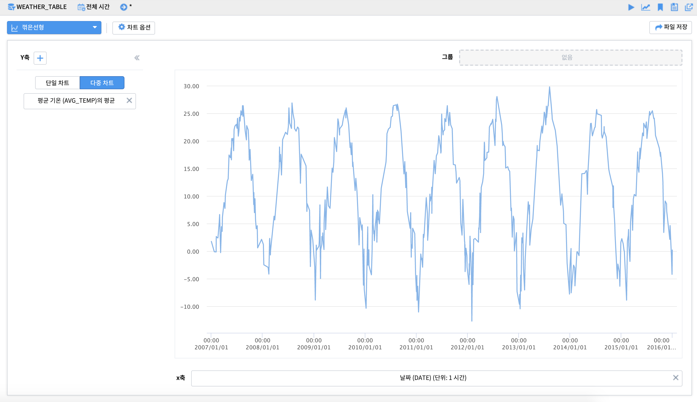
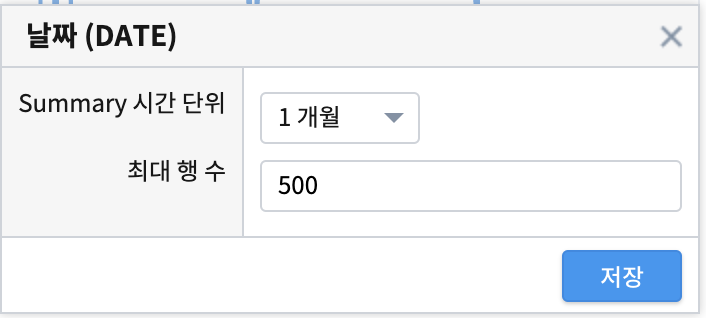
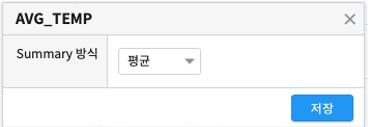
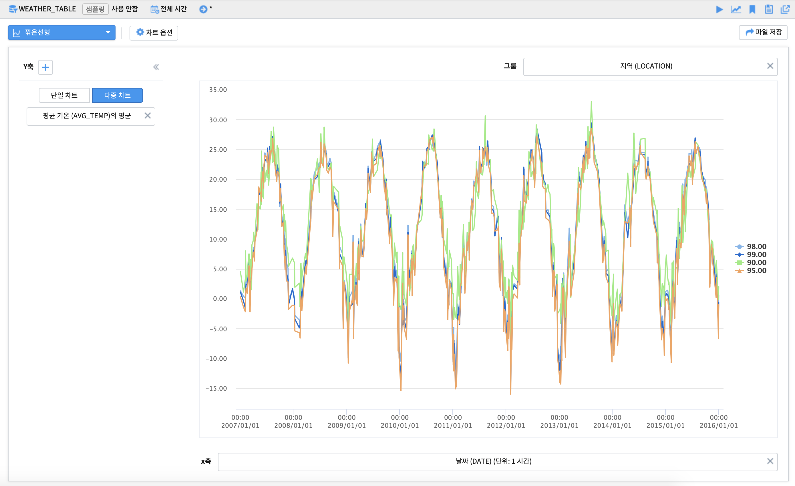
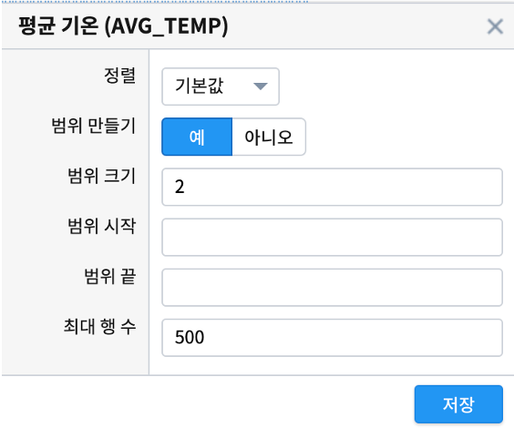
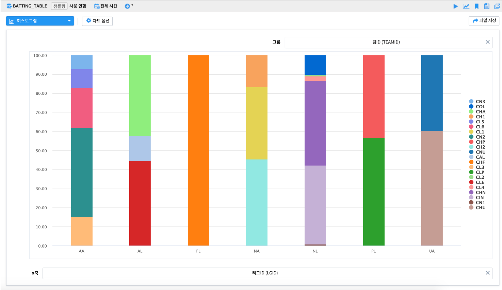
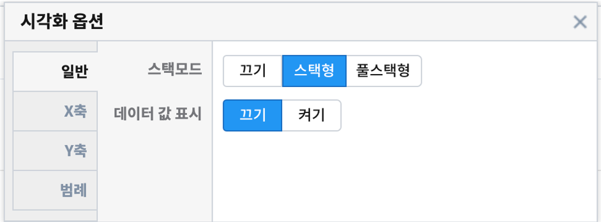

시각화 분석 유형
===================================================================================================================================

| 시계열, 분포, 관계형, 이상치, 지도형과 같은 시각화 분석 유형을 선택할 수 있습니다. 

.. image:: images/kor/02_show_charts/show_charts_00.png

|
|

꺽은선형 - 단일 차트 - 시계열 그래프
-----------------------------------------------------------------------------------------------------------------------------------
시간의 흐름(x축)에 따라 y축의 시계열 변화를 보고자 할 때 사용합니다. 

|

**x축 옵션**

**y축 옵션**

**차트 옵션**

.. image:: images/kor/02_show_charts/show_charts_04.png

| x축과 y축에 설정한 변수를 각각 클릭하면 축 옵션을 이용가능합니다. 집계 시간단위(1시간, 1일, 1개월, 1년 등)나 집계 방식(합계, 평균, 최대, 최소 등)을 변경할 수 있습니다. 차트 옵션을 이용하면 결측값 표시여부, 축 제목, 범례 위치, 범례 표시 여부 등 다양한 시각화 옵션 조정이 가능합니다. 
| 축 옵션 및 차트 옵션에 관한 자세한 사항은 매뉴얼을 참조하시기 바랍니다. 

|
|

꺽은선형 - 단일 차트 - 그룹별 시계열 그래프
-----------------------------------------------------------------------------------------------------------------------------------
| 축의 단위가 같은 시계열을 그룹별로 구분하여 그래프를 그릴 수 있습니다. 일부 그룹의 필터링을 하기위해서 차트 왼쪽에 있는 필터를 사용할 수 있습니다. 

|

**필터링**

.. image:: images/kor/02_show_charts/show_charts_06.png

필터에 관한 자세한 사항은 매뉴얼의 핉터링 부분을 참조하시길 바랍니다. 

|
|

꺽은선형 - 단일 차트 - 중첩 시계열 그래프
-----------------------------------------------------------------------------------------------------------------------------------

| 축의 단위(속력, 전력량, 온도 등)가 같은 그래프들을 하나의 축을 기준으로 그릴 수 있습니다. 주로 유사한 단위나 scale이 비슷한의 변수를 비교할 때 사용합니다.  
| 중첩 시계열 그래프를 그리기 위해 y축 변수를 추가하고자 할때는 + 버튼을 눌러 변수를 추가합니다. 
| 이때 차트의 범례 순서는 y축의 순서를 조정하여 변경할 수 있습니다.  

.. image:: images/kor/02_show_charts/show_charts_07.png
.. image:: images/kor/02_show_charts/show_charts_08.png

| 주의) 비교하고자 하는 변수들의 단위가 다르거나 특정 변수의 scale이 매우 큰 경우(예:전력량 0~10000과 온도 -10~30)에는 단일 차트를 시용하기보다는 다중 차트를 이용하는것을 권장합니다. 

|
|

꺽은선형 - 다중 차트 - 다중 시계열 그래프
-----------------------------------------------------------------------------------------------------------------------------------

| 축의 단위(속력, 전력량, 온도 등)가 다르거나, 축이 동일해도 scale이 다른 그래프들을 다중 차트로 그릴 수 있습니다.
| 다중 시계열 그래프를 그리기 위해 y축 변수를 추가하고자 할때는 + 버튼을 눌러 컬럼을 추가합니다. 

.. image:: images/kor/02_show_charts/show_charts_09.png

|
|

시계열 분포 - 산점도
-----------------------------------------------------------------------------------------------------------------------------------
| x축, y축으로 이루어진 직교좌표 위에 값을 점으로 나타낸 그래프입니다. 두 개 변수 간의 관계를 나타내는 방법입니다. 두 개 변수 간의 관계를 통해 선형 이나 비선형의 형태와 같은 모델을 확인해봄으로써 그 방향성과 강도를 조사할 수 있습니다.

.. image:: images/kor/02_show_charts/show_charts_10.png

|
|

모션 차트
-----------------------------------------------------------------------------------------------------------------------------------
| 시간에 따른 데이터를 x축, y축으로된 2차원 공간에서 버블의 크기와 다양한 색상, 데이터의 변화를 보여주는 차트입니다. 
| 재생, 일시정지, 다시 재생, 중단의 옵션을 통해 데이터의 움직임을 조정할 수 있습니다. 

.. image:: images/kor/02_show_charts/show_charts_11.png

|
|

히스토그램 - 단일 히스토그램 
-----------------------------------------------------------------------------------------------------------------------------------
| 연속형 변수를 일정 구간을 나누어 그 빈도를 그래프로 나타낸 것입니다. x축의 구간 간격(bin size) 조정을 통해 집계 빈도를 조정 할 수 있습니다. 
|

**기본형**

.. image:: images/kor/02_show_charts/show_charts_12.png

|

**기본형 - 구간 간격 조정**

.. image:: images/kor/02_show_charts/show_charts_13.png

|

**x축 옵션**

| x축에 설정한 변수를 클릭하면 축 옵션을 이용가능합니다. 특히 범위 만들기를 '예'로 변경하여 구간 간격(bin size; range size)를 조정 할 수 있습니다. 축 옵션에 관한 자세한 사항은 매뉴얼을 참조하시기 바랍니다. 
|
|

히스토그램 - 그룹별 히스토그램
-----------------------------------------------------------------------------------------------------------------------------------
| 연속형 변수를 일정 구간을 나누어 그 빈도를 그래프로 나타낸 것입니다. 그룹에 변수를 매핑하여 그룹간 분포를 비교할 수 있습니다. 

.. image:: images/kor/02_show_charts/show_charts_15.png

|
|

막대형 그래프 - 기본형
-----------------------------------------------------------------------------------------------------------------------------------
| 범주형 변수의 빈도를 막대 그래프로 나타낸 것입니다. 히스토그램보다 심화된 작업을 할때 주로 사용합니다. 

.. image:: images/kor/02_show_charts/show_charts_16_0.png

|
|

막대형 그래프 - 집계형
-----------------------------------------------------------------------------------------------------------------------------------
| 범주형 변수의 빈도를 막대 그래프로 나타낸 것입니다. y축(이벤트 개수)에 원하는 변수를 넣어서 집계(합계, 평균 등)된 막대그래프를 표현할 수 있습니다. 

.. image:: images/kor/02_show_charts/show_charts_16_1.png

| x축과 y축에 설정한 변수를 각각 클릭하면 축 옵션을 이용가능합니다. x축의 순서(오름차순/내림차순)나 y축의 집계 방식(합계, 평균, 최대, 최소 등)을 변경할 수 있습니다. 차트 옵션을 이용하면 결측값 표시여부, 축 제목, 범례 위치, 범례 표시 여부 등 다양한 시각화 옵션 조정이 가능합니다. 
| 축 옵션 및 차트 옵션에 관한 자세한 사항은 매뉴얼을 참조하시기 바랍니다. 

|
|

누적 막대형 그래프 - 스택형/풀스택형
-----------------------------------------------------------------------------------------------------------------------------------
| 범주형 변수의 그룹별 빈도를 막대 그래프로 나타낸 것입니다. 햔재 x축 변수에서 그룹 변수가 차지하고 있는 빈도를 확인 가능합니다. 
| 스택형은 데이터의 빈도를 그룹별로 누적 빈도를, 풀스택형은 전체를 기준으로 그룹별 상대적 비율(누적퍼센트)을 집계해 줍니다. 
|

**스택형**

.. image:: images/kor/02_show_charts/show_charts_17.png

|

**풀스택형**

|

**차트 옵션**

| 차트 상단의 차트 옵션을 이용하면 스택형/풀스택형의 모드 유형, 데이터 값의 표현 여부 등을 조정 할 수 있습니다. 
| 축 옵션 및 차트 옵션에 관한 자세한 사항은 매뉴얼을 참조하시기 바랍니다. 

|
|

원형 그래프 - 기본형
-----------------------------------------------------------------------------------------------------------------------------------
| 원형 그래프는 섹터로 구분된 원 그래프이며 각 파이 섹터는 일부 관련 정보의 크기를 표시합니다. 원형 그래프는 전체를 기준으로 한 부분의 상대적 크기를 표시하는 데 사용됩니다.
| 원형 그래프는 전체를 기준으로 한 부분의 상대적 크기를 표시하는 데 사용됩니다. 기본형은 그룹의 단순 빈도를 나타낼때 사용할 수 있습니다. 

.. image:: images/kor/02_show_charts/show_charts_20.png

**차트 옵션**

.. image:: images/kor/02_show_charts/show_charts_21.png

차트 옵션을 통해 최소 조각의 크기를 설정하여 나머지를 그외(other) 조각으로 병합할 수 있습니다. 

| 
|
|

원형 그래프 - 집계형
-----------------------------------------------------------------------------------------------------------------------------------
| 원형 그래프는 섹터로 구분된 원 그래프이며 각 파이 섹터는 일부 관련 정보의 크기를 표시합니다. 집계형은 변수의 집계값(합계, 평균 등)의 값을 파이의 크기에 반영합니다. 

.. image:: images/kor/02_show_charts/show_charts_22.png

|
|

Sankey chart
-----------------------------------------------------------------------------------------------------------------------------------

|
|

히트맵
-----------------------------------------------------------------------------------------------------------------------------------

|
|

이상치 그래프
-----------------------------------------------------------------------------------------------------------------------------------

|
|